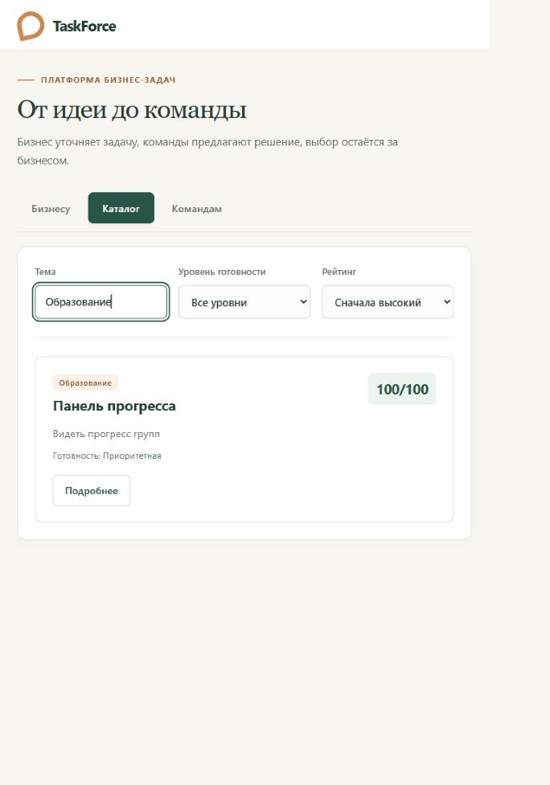
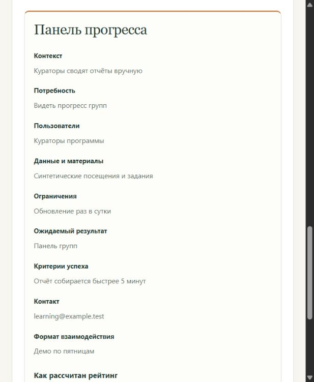
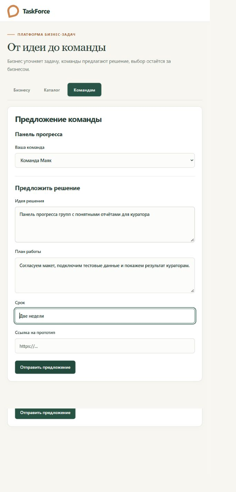
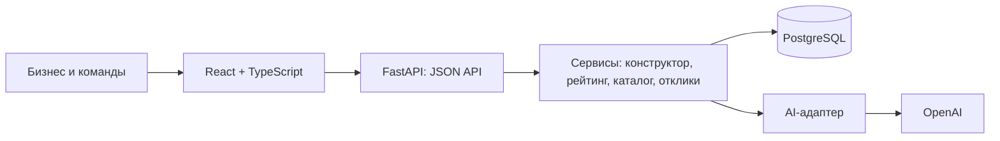

# TaskForce — от бизнес-проблемы до предложения команды

Бизнес описывает проблему своими словами. AI задаёт три уточняющих вопроса и собирает редактируемую карточку. После ручного подтверждения система рассчитывает прозрачный рейтинг готовности задачи. Опубликованные задачи доступны студенческим командам, а выбор исполнителей остаётся за бизнесом.

**Основной сценарий:** описание → вопросы → карточка → подтверждение → рейтинг → публикация → отклики → решение бизнеса.

## Интерфейс TaskForce

Актуальный интерфейс на синтетических данных. Каталог с фильтром по теме:



<details>
<summary>Разбивка рейтинга и форма предложения команды</summary>

Баллы по каждому критерию и сведения, которые ещё нужно уточнить:



Выбор команды, идея решения, план и срок. На скриншоте показано заполнение формы до отправки:



</details>

## Быстрый запуск

Нужны **Git, Docker Desktop / Docker Engine и Docker Compose v2**. Для режима OpenAI нужен API-ключ с доступом к выбранной модели. Python и Node.js на компьютере для запуска через Docker не требуются.

### 1. Получить проект

```sh
git clone https://github.com/BAITC-Hacks/hack-181acac4-team.git
cd hack-181acac4-team
```

Для закрытого репозитория потребуется доступ GitHub. Если проект уже скачан, обновите свою копию перед запуском.

### 2. Настроить окружение

Создайте `.env` из `.env.example`, если своего `.env` ещё нет.

**PowerShell:**

```powershell
Copy-Item .env.example .env
```

**macOS / Linux:**

```sh
cp .env.example .env
```

Заполните `OPENAI_API_KEY` в `.env`. Файл исключён из Git; ключ используется только backend. Для создания карточек необходим действующий ключ OpenAI.

| Переменная | Значение по умолчанию | Назначение |
| --- | --- | --- |
| `OPENAI_API_KEY` | пусто | Ключ основного AI-провайдера |
| `OPENAI_MODEL` | `gpt-4.1-mini` | Модель OpenAI |
| `POSTGRES_USER` | `hack` | Пользователь локальной БД |
| `POSTGRES_PASSWORD` | `hack` | Пароль локальной БД для демо |
| `POSTGRES_DB` | `hackalem` | Имя базы |

Compose формирует `DATABASE_URL` для backend и `API_PROXY_TARGET` для frontend автоматически. Значения PostgreSQL в примере предназначены для локального демо.

### 3. Запустить и загрузить примеры

```sh
docker compose up -d --build
docker compose ps
```

Дождитесь готовности backend: [проверка сервиса](http://localhost:8000/api/health) должна вернуть `{"status":"ok"}`. Она проверяет также соединение с базой. Затем:

```sh
docker compose exec backend python -m app.seed
```

При первом запуске загрузчик добавляет **5 черновиков, 5 карточек, 5 профилей команд и 5 предложений**. Повторный запуск не создаёт дубликаты и не перезаписывает существующие записи. Каталог показывает только опубликованные карточки, поэтому число задач в нём может быть меньше пяти.

| Адрес | Назначение |
| --- | --- |
| [localhost:5173](http://localhost:5173) | Приложение |
| [localhost:8000/docs](http://localhost:8000/docs) | Интерактивная документация API |
| [localhost:8000/api/health](http://localhost:8000/api/health) | Проверка API и PostgreSQL |

Данные сохраняются в Docker volume `postgres_data`. Остановка без удаления данных: `docker compose down`.

## Deployment / развёртывание на сервере

Ниже — инструкция для отдельного Linux VPS с Docker Compose v2, доменом и доступом по SSH. Это конфигурация для удалённого показа MVP: общий пароль ограничивает доступ к демо, но не заменяет авторизацию пользователей и проверку прав внутри приложения. Используйте синтетические данные. Развёртывание на реальном VPS в рамках проекта ещё не проверялось.

### 1. Подготовить сервер

- Установите Git, Docker Engine и Compose v2.
- Направьте DNS A-запись вашего домена на IP сервера. Если настроена AAAA-запись, она тоже должна указывать на работающий сервер.
- Разрешите входящие TCP-порты 80 и 443; SSH оставьте доступным для администрирования. Базу и API наружу не публикуем.
- Склонируйте репозиторий и настройте `.env`, как в разделе быстрого запуска. Укажите действующий `OPENAI_API_KEY` и отдельный пароль PostgreSQL. Для текущего формирования URL используйте пароль из букв и цифр без URL-спецсимволов, например результат `openssl rand -hex 24`.

Добавьте в `.env`:

```dotenv
APP_DOMAIN=taskforce.example.com
DEMO_PASSWORD_HASH='вставьте_хеш_пароля'
```

Замените пример домена своим. Получить хеш общего пароля демо можно интерактивно:

```sh
docker run --rm -it caddy:2-alpine caddy hash-password
```

Скопируйте полученный хеш в одинарных кавычках: так символы `$` сохранятся буквально. Сам пароль передайте проверяющим отдельно от репозитория. Не коммитьте `.env`.

### 2. Создать конфигурацию развёртывания

В корне проекта создайте `compose.deploy.yml` со следующим содержимым. Это **самостоятельный** Compose-файл; его не нужно объединять с локальным `docker-compose.yml`.

```yaml
services:
  db:
    image: postgres:16-alpine
    restart: unless-stopped
    environment:
      POSTGRES_USER: ${POSTGRES_USER}
      POSTGRES_PASSWORD: ${POSTGRES_PASSWORD}
      POSTGRES_DB: ${POSTGRES_DB}
    volumes:
      - postgres_data:/var/lib/postgresql/data
    healthcheck:
      test: ["CMD-SHELL", "pg_isready -U ${POSTGRES_USER} -d ${POSTGRES_DB}"]
      interval: 5s
      timeout: 5s
      retries: 10
  backend:
    build: ./backend
    restart: unless-stopped
    environment:
      DATABASE_URL: postgresql+psycopg://${POSTGRES_USER}:${POSTGRES_PASSWORD}@db:5432/${POSTGRES_DB}
      OPENAI_API_KEY: ${OPENAI_API_KEY}
      OPENAI_MODEL: ${OPENAI_MODEL:-gpt-4.1-mini}
    depends_on:
      db:
        condition: service_healthy
  web:
    image: caddy:2-alpine
    restart: unless-stopped
    ports:
      - "80:80"
      - "443:443"
    environment:
      APP_DOMAIN: ${APP_DOMAIN}
      DEMO_PASSWORD_HASH: ${DEMO_PASSWORD_HASH}
    volumes:
      - ./Caddyfile:/etc/caddy/Caddyfile:ro
      - ./frontend/dist:/srv:ro
      - caddy_data:/data
      - caddy_config:/config
    depends_on:
      - backend
volumes:
  postgres_data:
  caddy_data:
  caddy_config:
```

Рядом создайте `Caddyfile`:

```caddyfile
{$APP_DOMAIN} {
    basic_auth {
        judge {$DEMO_PASSWORD_HASH}
    }
    handle /api/* {
        reverse_proxy backend:8000
    }
    handle {
        root * /srv
        try_files {path} /index.html
        file_server
    }
}
```

Caddy отдаёт собранный frontend, направляет `/api/*` в FastAPI и управляет HTTPS-сертификатом при доступном домене и портах. Схема маршрутизации следует [официальным примерам Caddy для SPA и API](https://caddyserver.com/docs/caddyfile/patterns). Vite dev server при таком запуске не используется.

### 3. Собрать и запустить

Из корня проекта на сервере:

```sh
docker compose build frontend
docker compose run --rm --no-deps frontend sh -c "npm ci && npm run build"
docker compose -p taskforce-demo -f compose.deploy.yml config --quiet
docker compose -p taskforce-demo -f compose.deploy.yml up -d --build
docker compose -p taskforce-demo -f compose.deploy.yml ps
```

Первая пара команд использует контейнер frontend только для сборки и записывает `frontend/dist` на сервер. Backend запускается из своего Dockerfile без `--reload`. Дождитесь готовности API, затем загрузите примеры:

```sh
docker compose -p taskforce-demo -f compose.deploy.yml exec backend python -m app.seed
```

Откройте `https://ваш-домен` и войдите с логином `judge` и выбранным паролем. Проверка API (curl запросит пароль):

```sh
curl --fail --user judge https://ваш-домен/api/health
```

Ожидается `{"status":"ok"}`. Затем пройдите создание карточки, публикацию, отклик и решение бизнеса. Если HTTPS ещё не готов, проверьте DNS и логи:

```sh
docker compose -p taskforce-demo -f compose.deploy.yml logs --tail 80 web backend
```

### 4. Обновление и сохранность данных

После merge в `main`:

```sh
git pull --ff-only origin main
docker compose build frontend
docker compose run --rm --no-deps frontend sh -c "npm ci && npm run build"
docker compose -p taskforce-demo -f compose.deploy.yml up -d --build
docker compose -p taskforce-demo -f compose.deploy.yml restart web
```

Пересоздание контейнеров сохраняет данные в volume. Не используйте `down -v`, если данные нужны. Перед обновлением сделайте резервную копию на сервере:

```sh
docker compose -p taskforce-demo -f compose.deploy.yml exec -T db sh -c 'pg_dump -U "$POSTGRES_USER" "$POSTGRES_DB"' > backup.sql
```

Храните резервную копию вне репозитория. В проекте пока нет миграций: изменение схемы БД требует отдельного плана обновления. Общий пароль демо не разделяет права бизнеса и команд; полноценный публичный запуск требует серверной авторизации и контроля доступа.

## Демо за пять минут

Перед показом запустите сервисы и загрузите примеры. Время ответа зависит от внешнего API OpenAI.

| Время | Действие | Что видно |
| --- | --- | --- |
| 0:00–1:00 | Ввести описание кондитерской, нажать «Далее» и ответить на три вопроса | Вопросы связаны с бизнес-задачей, появляется карточка |
| 1:00–2:00 | Проверить поля, подтвердить неполную карточку | Рейтинг и конкретные пробелы |
| 2:00–3:00 | Добавить сведения, подтвердить снова, опубликовать | Рост баллов, переход в каталог |
| 3:00–4:00 | Открыть задачу в каталоге, выбрать команду и отправить предложение | Задача доступна командам, предложение сохранено |
| 4:00–5:00 | Вернуться в «Бизнесу», обновить предложения, принять одно; перезагрузить страницу | Решение принимает человек, состояние сохранено |

**Исходное описание:**

> У нас кондитерская. Заказы приходят в разные мессенджеры, сейчас записываем их в тетрадку. Иногда заказы теряются. Хотим упорядочить работу двух администраторов.

Вопросы OpenAI не фиксированы. Отвечайте по их смыслу, используя только сведения, которые хотите включить в задачу. Неизвестное можно обозначить словами «не знаю».

### Воспроизводимый рост рейтинга: 45 → 100

Чтобы показать формулу независимо от вариативности AI, вручную проверьте карточку перед подтверждением. Для **45 баллов** оставьте заполненными только четыре оцениваемых поля:

| Поле | Текст для демо |
| --- | --- |
| Контекст | Заказы приходят в мессенджеры, записываем их в тетрадку |
| Потребность | Хотим, чтобы заказы не терялись |
| Пользователи | Два администратора кондитерской |
| Ожидаемый результат | Страница со списком заказов и статусами «новый», «готовится», «готов» |

Название можно указать «Учёт заказов», тему — «Кондитерская». После подтверждения получите **45/100 — рабочая**. Затем добавьте:

| Поле | Новые сведения | Прибавка |
| --- | --- | --- |
| Данные | Передадим обезличенную таблицу из 100 заказов | +20 |
| Критерии успеха | За неделю теста ни один заказ не потерян, поиск занимает до 30 секунд | +15 |
| Ограничения | Прототип за две недели, без интеграций с мессенджерами | +10 |
| Контакт | bakery@example.test | +5 |
| Формат взаимодействия | Созвон с командой разработчиков раз в неделю | +5 |

Подтвердите снова: **100/100 — приоритетная**. Адрес и данные примера синтетические.

## Рейтинг: понятная формула

Расчёт находится в [services/scoring.py](backend/app/services/scoring.py). Он не вызывает AI и не зависит от количества откликов.

| Критерий | Максимум | Условие начисления |
| --- | ---: | --- |
| Контекст и потребность | 20 | По 10 за каждое поле |
| Данные и материалы | 20 | Непустое поле |
| Ожидаемый результат | 15 | Непустое поле |
| Критерии успеха | 15 | Непустое поле |
| Ограничения | 10 | Непустое поле |
| Пользователи | 10 | Непустое поле |
| Связь с бизнесом | 10 | Контакт — 5, формат взаимодействия — 5 |
| **Всего** | **100** | Только после ручного подтверждения |

Название и тема на баллы не влияют. Пробельные строки считаются пустыми. Смысл AI-заполнения проверяется до расчёта, а человек проверяет карточку перед подтверждением. Сама формула оценивает **полноту подтверждённых полей**, а не коммерческую ценность или сложность проекта. Ручной ввод не проходит отдельную AI-проверку.

| Баллы | Уровень |
| --- | --- |
| 0–39 | Черновик |
| 40–69 | Рабочая |
| 70–89 | Готовая |
| 90–100 | Приоритетная |

Уровень «Черновик» не равен статусу публикации: задачу с низким рейтингом можно подтвердить, опубликовать и получать отклики. Улучшение описания повышает её позицию при сортировке по убыванию баллов.

## Где используется AI

Основной провайдер — **OpenAI**. Реализация, промпты и схемы ответов: [ai/client.py](backend/app/ai/client.py).

1. Модель анализирует описание и возвращает ровно три разных вопроса. Для подробного ввода вопросы уточняют детали.
2. Описание и ответы преобразуются в структурированные поля. Для фактов запрашиваются цитаты с указанием источника.
3. Backend проверяет цитаты по исходному тексту; допускает различия регистра и пробелов. Несколько проверенных фрагментов одного поля объединяются.
4. Для незаполненных полей предусмотрена одна дополнительная попытка извлечения. Затем отдельный запрос проверяет смысловое соответствие полей.
5. Неподтверждённые сведения остаются пустыми. Явные оговорки о неопределённой передаче данных дополнительно проверяются локально.
6. Бизнес редактирует и подтверждает результат. AI не публикует задачу и не выбирает исполнителя.

Например, «принимаем заказы в Telegram» описывает процесс, но само по себе не означает, что команда получит данные. «Дадим обезличенную таблицу заказов» описывает доступные материалы. Работа администраторов не считается форматом общения бизнеса с разработчиками.

Используются Structured Outputs и Pydantic. Таймаут каждого обращения к провайдеру — 45 секунд; сборка может включать несколько последовательных обращений. При ошибке API или некорректном структурном ответе пользователь получает сообщение и может повторить действие; введённые ответы остаются на экране. Обновление страницы до успешного сохранения может потерять несохранённый ввод. Диагностика отброшенных полей содержит имя поля и код причины, без текста источников.

**Ограничение:** проверка модели вероятностная и не гарантирует правильную классификацию каждого факта. Дословная цитата сама по себе не доказывает её уместность в поле; ручная проверка остаётся обязательной.


## Архитектура и данные



Стек: Python 3.12, FastAPI, Pydantic, SQLAlchemy 2, PostgreSQL 16; React, TypeScript, Vite; Docker Compose. Версии зависимостей зафиксированы в [requirements.txt](backend/requirements.txt) и [package-lock.json](frontend/package-lock.json).

| Модуль | Ответственность |
| --- | --- |
| `backend/app/models.py` | SQLAlchemy-модели и связи таблиц |
| `backend/app/schemas.py` | Pydantic-контракт и проверка входа |
| `backend/app/drafts.py`, `cards.py`, `catalog.py`, `proposals.py` | HTTP-маршруты |
| `backend/app/services/` | Правила карточек, рейтинг, запросы каталога, решения по откликам |
| `backend/app/ai/` | Работа с моделью, извлечение и проверка фактов |
| `backend/app/seed.py` | Повторяемая загрузка синтетических примеров |
| `frontend/src/features/` | Конструктор, каталог, рейтинг, отклики |
| `frontend/src/types.ts` | Типы JSON-контракта frontend |

Основные сущности: `TaskDraft` хранит описание, вопросы и ответы; `TaskCard` — поля задачи и рейтинг; `TeamProfile` — команду; `Proposal` — предложение с привязкой к карточке и команде. `ScoreBreakdown` содержит сумму, уровень, баллы по критериям и недостающие поля. Идентификаторы — UUID, имена полей API — `snake_case`.

Карточка включает название, тему, контекст, потребность, пользователей, материалы, ограничения, результат, критерии успеха, контакт и формат общения.

**Переходы состояния:**

- Черновик: `collecting` → `card_created`. Повторная отправка ответов возвращает созданную карточку и не затирает ручные правки.
- Карточка: `editing` → `confirmed` → `published`. Сохранённое изменение содержания возвращает её в `editing`, сбрасывает рейтинг и снимает публикацию. Нужны новое подтверждение и публикация; отклики сохраняются.
- Предложение: `submitted` → `accepted` или `rejected`. Решения независимы; в текущем MVP решение можно изменить.

## API

Полные схемы запросов и ответов доступны в [Swagger UI](http://localhost:8000/docs).

| Метод | Маршрут | Действие |
| --- | --- | --- |
| POST | `/api/drafts` | Создать черновик и получить вопросы |
| GET | `/api/drafts/{id}` | Восстановить черновик |
| POST | `/api/drafts/{id}/answers` | Собрать карточку по ответам |
| GET | `/api/drafts/{id}/card` | Получить карточку черновика |
| GET / PATCH | `/api/cards/{id}` | Прочитать / отредактировать карточку |
| POST | `/api/cards/{id}/confirm` | Подтвердить и пересчитать рейтинг |
| POST | `/api/cards/{id}/publish` | Опубликовать подтверждённую карточку |
| GET | `/api/tasks` | Каталог: `topic`, `level`, `sort=asc\|desc` |
| GET | `/api/tasks/{id}` | Подробности опубликованной задачи |
| GET | `/api/teams` | Профили команд |
| GET / POST | `/api/tasks/{id}/proposals` | Получить / отправить предложения |
| POST | `/api/proposals/{id}/decision` | Принять или отклонить предложение |

Фильтр темы — точное совпадение без учёта регистра в PostgreSQL. Пустой фильтр показывает все темы. Отклики разрешены только на опубликованные задачи, число предложений не ограничивается. Идея, план и срок обязательны; ссылка на прототип необязательна и должна использовать HTTP(S).

## Проверки

Локально нужны Python 3.12 и Node.js 22. Из корня проекта:

```sh
python -m venv .venv
```

Активируйте окружение: `.venv\Scripts\Activate.ps1` в PowerShell или `source .venv/bin/activate` в macOS/Linux. Затем:

```sh
python -m pip install -r backend/requirements.txt
cd backend
python -m unittest discover -s tests -v
cd ../frontend
npm ci
npm run build
```

| Набор | Что проверяет |
| --- | --- |
| `test_intake.py` | Подтверждение, повторные запросы, ошибки провайдера, цитаты и смысловая проверка с имитацией AI |
| `test_scoring.py` | Формулу, границы уровней, рост баллов, отсутствие баллов без подтверждения |
| `test_integration.py` | Путь через API, низкий рейтинг, несколько откликов и независимые решения |
| `test_seed.py` | Полноту и согласованность синтетического набора |
| `test_seed_loading.py` | Связи при загрузке, повторный запуск, сохранение существующих правок |

Автоматические проверки БД используют SQLite в памяти, вызовы OpenAI имитируются. Они не заменяют проверку PostgreSQL и реального провайдера через Docker. Для ручной проверки используйте сценарий демо, дополнительно проверьте запрет публикации до подтверждения и сохранение решения после перезагрузки.

## Если что-то не работает

| Симптом | Что проверить |
| --- | --- |
| Сервис недоступен | `docker compose ps`, затем `docker compose logs --tail 80 backend` |
| Нет команд для выбора | Выполнить `docker compose exec backend python -m app.seed` |
| Мало карточек в каталоге | В каталоге только опубликованные карточки; сбросить фильтры |
| Изменили ключ или модель | `docker compose up -d --force-recreate backend` — простого restart для новых переменных недостаточно |
| OpenAI не отвечает | Проверить ключ, доступ к модели и соединение; повторить запрос |
| Поля остались пустыми | Проверить, были ли сведения в описании и ответах; заполнить вручную. Три ответа не гарантируют полноту всех полей |
| Изменили промпт, но карточка прежняя | Создать новую задачу: сохранённые карточки не пересобираются автоматически |
| Видна старая версия интерфейса | `docker compose restart frontend`, затем обновить страницу |
| Порт занят | Освободить 5173, 8000 или 5432 либо изменить проброс порта в Compose |

## Границы MVP и работа команды

Приложение предназначено для локального хакатонного демо. Регистрация и серверная проверка прав владельца не реализованы: переключение разделов не является авторизацией. Профили команд загружаются из тестового набора; формы регистрации команды нет. Интерфейс восстанавливает последнюю сохранённую задачу в этом браузере, полноценного кабинета со списком всех задач бизнеса пока нет.

Для публичного запуска потребуются авторизация, контроль доступа, миграции БД и ограничение запросов. В текущем запуске таблицы создаются автоматически. Файловое хранилище, уведомления и автоматическое назначение команд не реализованы.

Распределение ответственности и общий контракт — в [AGENTS.md](AGENTS.md). Anuar отвечает за AI, конструктор и интеграцию; Kojizz — за рейтинг и тестовые данные; Aslan — за каталог и отклики. Изменения выполняются в отдельных ветках, интеграция — через PR в `main`.
